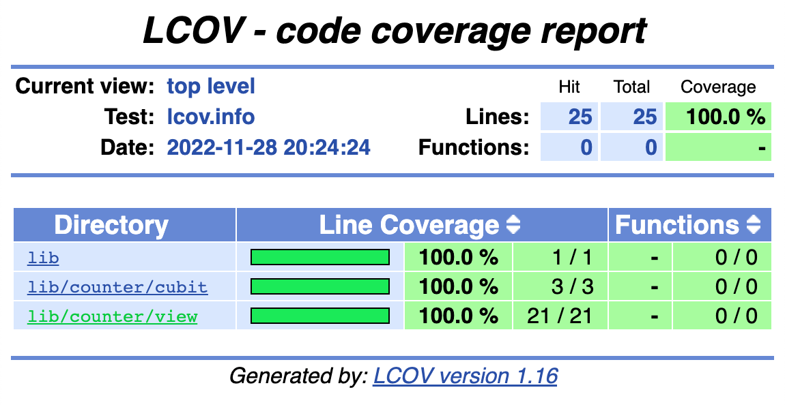

# Cubit Counter

> [Made following the docs.](https://bloclibrary.dev/#/fluttercountertutorial) 

---

## Packages 
- bloc
- flutter_bloc
- bloc_test
- flutter_test
- integration_test
- mocktail
- very_good_analysis

---

## Coverage

    

